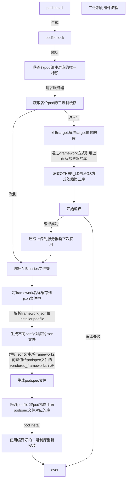

```mermaid
graph TD
a[pod install] --> |生成|b[podfile.lock] --> |解析|c[获得各pod组件对应的唯一标识] --> 
|请求服务器|d[获取各个pod的二进制缓存]
d --> |取到|e[解压到Binaries文件夹]
d --> |取不到|o[分析target,解除target依赖的库]
o --> |通过-framework方式引用上面解除依赖的库|p[设置OTHER_LDFLAGS方式依赖第三库]
p --> q[开始编译]
q --> |编译成功|h[压缩上传到服务器备下次使用]
q --> |编译失败|m
h --> e
e --> g[将framework名称缓存到json文件中]
g --> |解析framework.json和installer.podfile|x[生成不同config对应的json文件]
x --> |解析json文件,将frameworks的赋值给podspec文件的vendored_frameworks字段|j[生成podspec文件]
j --> k[修改podfile 将pod指向上面podspec文件对应的库]
k --> |pod install|l[使用编译好的二进制库重新安装]
l --> m[over]
F[二进制化组件流程]


```

