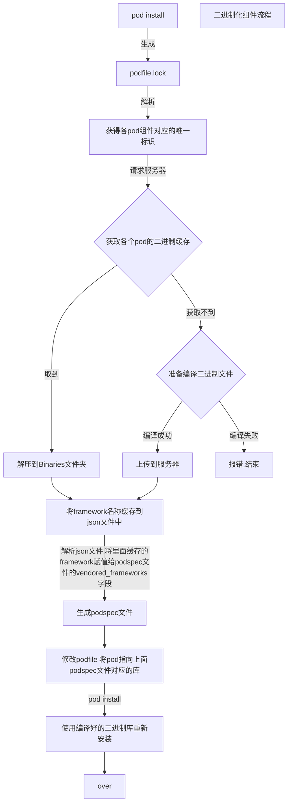

```mermaid
graph TD
a[pod install] --> |生成|b[podfile.lock] --> |解析|c[获得各pod组件对应的唯一标识] --> 
|请求服务器|d{获取各个pod的二进制缓存}
d --> |取到|e[解压到Binaries文件夹]
d --> |获取不到|f{准备编译二进制文件}
f --> |编译成功|h[上传到服务器]
f --> |编译失败|i[报错,结束]
e --> g[将framework名称缓存到json文件中]
h --> g
g --> |解析json文件,将里面缓存的framework赋值给podspec文件的vendored_frameworks字段|j[生成podspec文件]
j --> k[修改podfile 将pod指向上面podspec文件对应的库]
k --> |pod install|l[使用编译好的二进制库重新安装]
l --> m[over]
F[二进制化组件流程]


```

